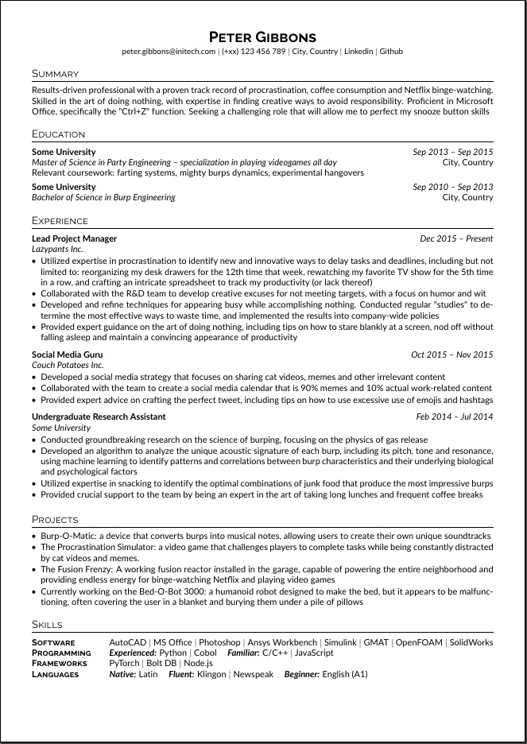

# LaTeX Template for my CV

This is a LaTeX template for a simple clean CV, developed from scratch with minimal dependencies. Inspired from [jakegut/resume](https://github.com/jakegut/resume) and [muratcankaracabey/latex_cv](https://github.com/muratcankaracabey/latex_cv).

<p align="center">
    
</p>

How to use
----------

1. Clone this repository to your local machine
2. Open the `resume.tex` file in your favorite LaTeX editor
3. Customize the template to fit your needs
4. Compile the PDF file using your preferred LaTeX compiler

For a quick start on Ubuntu you can install the following packages:
```
sudo apt install texworks texlive-fonts-recommended texlive-fonts-extra
```
Then open `resume.tex` on Texworks and compile it using pdfLaTeX.


Requirements
------------

* LaTeX compiler (recommended: TeX Live)
* Font (default: lato, raleway)

License
-------

This template is licensed under the MIT License. You are free to use, modify, and distribute it as you see fit. See the file named LICENSE for more information.
